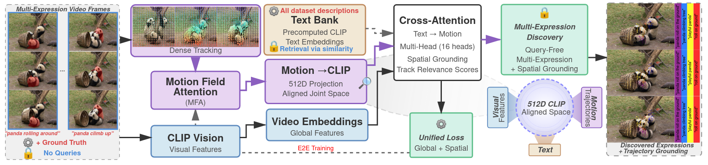
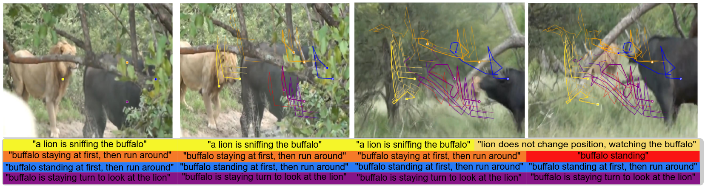

# TCAM: Track and Caption Any Motion

**Query-Free Motion Discovery and Description in Videos**

A novel framework for automatic motion pattern discovery and description in videos without requiring user queries. TCAM combines trajectory tracking with natural language generation to provide comprehensive motion understanding.

## Overview

TCAM (Track and Caption Any Motion) addresses the fundamental challenge of understanding and describing motion patterns in complex video scenarios. The framework automatically discovers relevant motion events and generates natural language descriptions by retrieving expressions from precomputed text banks and spatially grounding them through trajectory tracking.

### Key Features

- **Query-Free Discovery**: Automatically identifies motion patterns without explicit user input
- **Multi-Expression Support**: Handles multiple motion descriptions per video
- **Spatial Grounding**: Associates textual descriptions with specific regions and trajectories
- **Robust Performance**: Maintains accuracy in challenging conditions with camera shake and occlusion

## Architecture

The TCAM framework consists of three main components:



1. **Trajectory Tracking Module**: Identifies and follows motion patterns across frames
2. **Text Bank Retrieval System**: Finds relevant expressions for discovered motions
3. **Spatial Grounding Mechanism**: Associates textual descriptions with specific video regions



## Performance

### Comprehensive Evaluation on MeViS

| Method | V2T R@1↑ | T2V R@1↑ | J↑ | F↑ | Query-free Discovery | Multi Expression |
|--------|----------|----------|----|----|----------------------|------------------|
| LMPM | 28.3 | 26.7 | 36.5 | 43.9 | ✗ | ✗ |
| ReferFormer | 35.2 | 33.8 | 42.8 | 49.6 | ✗ | ✗ |
| UNINEXT | 38.6 | 36.9 | 45.3 | 52.1 | ✗ | ✗ |
| TCAM w/o MFA | 51.7 | 49.2 | 59.9 | 64.8 | ✓ | ✓ |
| TCAM w/o spatial loss | 54.1 | 51.8 | 58.4 | 63.2 | ✓ | ✓ |
| **TCAM (Ours)** | **58.4** | **55.6** | **62.3** | **67.5** | **✓** | **✓** |

### Spatial Grounding Across Task Formulations

| Method | MeViS J↑ | MeViS F↑ | MeViS J&F↑ | HC-STVG m_vIoU↑ | HC-STVG m_tIoU↑ | HC-STVG vIoU@0.5↑ |
|--------|----------|----------|------------|-----------------|-----------------|-------------------|
| TubeDETR† | -- | -- | -- | 28.5 | 41.3 | 25.8 |
| STCAT† | -- | -- | -- | 31.2 | 44.6 | 28.3 |
| CG-STVG† | -- | -- | -- | 34.8 | 47.2 | 31.5 |
| ReferFormer‡ | 42.8 | 49.6 | 46.2 | -- | -- | -- |
| UNINEXT‡ | 45.3 | 52.1 | 48.7 | -- | -- | -- |
| **TCAM (Ours)** | **62.3** | **67.5** | **64.9** | **42.3** | **52.8** | **38.7** |

†STVG methods predict boxes and cannot produce masks
‡R-VOS methods predict masks and are not designed for box prediction

## Installation

### Prerequisites

- Python 3.8+
- PyTorch 1.12+
- CUDA 11.0+ (for GPU training)

### Setup

1. Clone the repository:
```bash
git clone git@bitbucket.org:aclabneu/tcam-track-and-caption-any-motion.git
cd tcam-track-and-caption-any-motion
```

2. Install dependencies:
```bash
pip install -r requirements.txt
```

3. Download datasets:
```bash
# MeViS dataset
bash scripts/download_mevis.sh

# LongVideoBench (optional for evaluation)
bash scripts/download_longvideobench.sh
```

## Usage

### Training

To train the TCAM model on the MeViS dataset:

```bash
python train_tcam.py \
    --data_root ./data/mevis \
    --output_dir ./outputs \
    --num_frames 16 \
    --batch_size 8 \
    --learning_rate 1e-4 \
    --num_epochs 50 \
    --distributed
```

### Evaluation

Evaluate on MeViS test set:

```bash
python evaluate_tcam.py \
    --model_path ./outputs/best_model.pth \
    --data_root ./data/mevis \
    --split test \
    --output_dir ./results
```

Zero-shot evaluation on LongVideoBench:

```bash
python evaluate_longvideo.py \
    --model_path ./outputs/best_model.pth \
    --data_root ./data/longvideobench \
    --output_dir ./results_longvideo
```

### Inference

For inference on custom videos:

```bash
python inference_tcam.py \
    --model_path ./outputs/best_model.pth \
    --video_path ./path/to/video.mp4 \
    --output_dir ./inference_results
```

## Code Structure

```
tcam/
├── tcam_dataset.py              # Dataset loader and multi-positive sampling
├── tcam_video_encoder.py        # Video encoding and trajectory extraction
├── tcam_text_encoder.py         # Text encoding and video-text matching
├── tcam_motion_attention.py     # Motion-focused attention mechanisms
├── tcam_spatial_grounding.py    # Spatial grounding and trajectory association
├── tcam_divergence_extractor.py # Divergence-based motion discovery
└── train_tcam.py               # Training pipeline and distributed setup
```

### Key Components

- **TCAMDataset**: Handles multi-positive training with multiple expressions per video
- **TCAMVideoEncoder**: Extracts spatio-temporal features and trajectories
- **TCAMVideoTextMatcher**: Performs video-text retrieval and matching
- **MotionAttention**: Focuses on motion-relevant regions and features
- **SpatialGrounding**: Associates text expressions with spatial trajectories

## Datasets

### MeViS Dataset
The primary evaluation benchmark for comprehensive assessment across:
- Query-free discovery
- Spatial grounding
- Multi-expression handling

### LongVideoBench
Qualitative evaluation dataset demonstrating generalizability without fine-tuning.

## Experimental Results

### Training Progression
The model learns to spatially ground motion expressions through progressive refinement of spatial attention and track classification. Training demonstrates improved discrimination between relevant motion and background tracks.

### Failure Cases
While TCAM demonstrates robust performance, challenging scenarios include:
- Complex occlusions affecting trajectory consistency
- Rapid motion changes impacting expression grounding accuracy

## Citation

If you use this code or find our work helpful, please cite:

```bibtex
@inproceedings{tcam2024,
  title={Track and Caption Any Motion: Query-Free Motion Discovery and Description in Videos},
  author={Bishoy Galoaa and Sarah Ostadabbas},
  year={2026}
}
```

## License

This project is licensed under the MIT License - see the LICENSE file for details.

## Acknowledgments

This webpage template is adapted from [Nerfies](https://github.com/nerfies/nerfies.github.io), under a CC BY-SA 4.0 License.

## Contact

For questions and issues, please open an issue on the repository or contact the authors.
