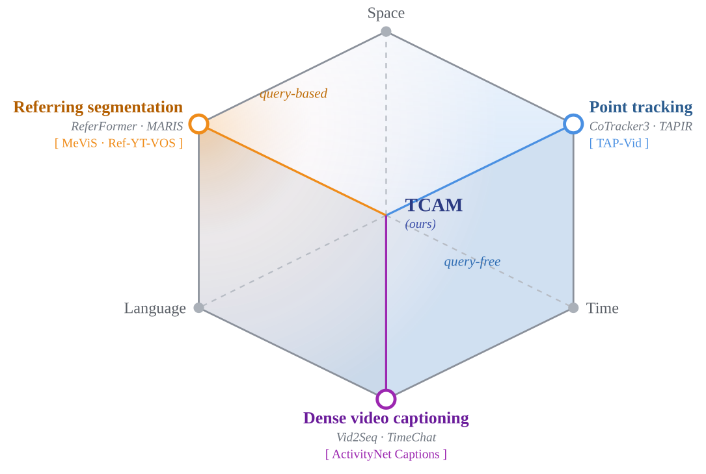
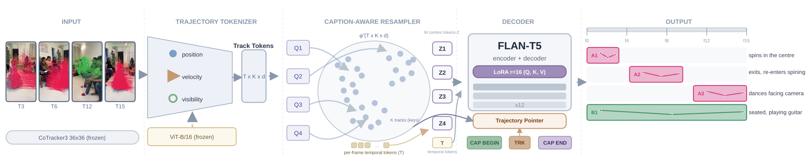

# TCAM: Track and Caption Any Motion

**Query-Free Motion Discovery and Description in Videos**

[🤗 Model & inference code](https://huggingface.co/bishoygaloaa/tcam)



Give TCAM a video and it tells you **what moves, when, and where**: it finds the motion
events in the video with no user query, describes each one in natural language, and
grounds each description to the point trajectories of the subject performing it.



## Run TCAM on your own videos

The pretrained model, inference pipeline and docs are on Hugging Face:
[**bishoygaloaa/tcam**](https://huggingface.co/bishoygaloaa/tcam).

```bash
git lfs install
git clone https://huggingface.co/bishoygaloaa/tcam && cd tcam

pip install torch==2.3.1 torchvision==0.18.1 --index-url https://download.pytorch.org/whl/cu121
pip install -r requirements.txt

python infer.py --video my_clip.mp4 --vis
```

This prints timestamped captions, writes them with the grounded tracks to
`tcam_out/my_clip.json`, and (with `--vis`) writes an overlay video. From Python:

```python
from tcam import TCAMPipeline

pipe = TCAMPipeline.from_pretrained("bishoygaloaa/tcam")
for e in pipe("my_clip.mp4").events:
    print(e.start_sec, e.end_sec, e.caption)
```

## Citation

```bibtex
@inproceedings{tcam2025,
  title={Track and Caption Any Motion: Query-Free Motion Discovery and Description in Videos},
  author={Bishoy Galoaa and Sarah Ostadabbas},
  year={2026}
}
```

## License

The code in this repository is released under the MIT License. The pretrained weights on
Hugging Face are released under CC BY-NC 4.0.

## Acknowledgments

This webpage template is adapted from [Nerfies](https://github.com/nerfies/nerfies.github.io), under a CC BY-SA 4.0 License.
